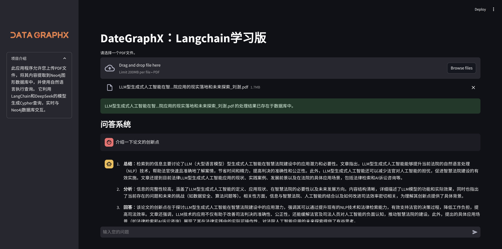
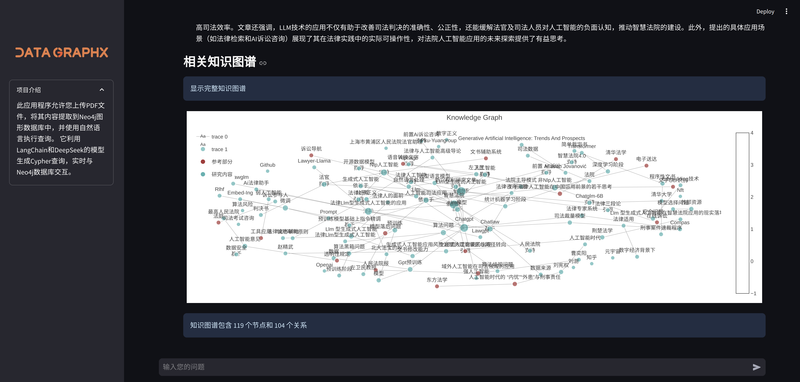

# DataGraphX (Learning Edition)

[English](#english) | [中文](#chinese)

> ⚠️ **Note**: This is a learning edition. For commercial use, please contact us for customized solutions!
> 
> ⚠️ **注意**: 这是学习版本。商业用途请联系我们定制解决方案！

<a name="english"></a>
## 🌟 DataGraphX

An intelligent document analysis system that combines LangChain, Neo4j graph database, and large language models to create a knowledge graph-based RAG (Retrieval-Augmented Generation) application.

### 🖼️ Project Demo

#### Q&A System Interface


#### Knowledge Graph Visualization


### 🚀 Features

- 📊 Automatic Knowledge Graph Construction
  - PDF document processing and analysis
  - Intelligent text segmentation
  - Relationship extraction
  - Interactive graph visualization

- 🤖 Natural Language Q&A
  - Context-aware responses
  - Knowledge graph-based retrieval
  - Multi-LLM support (DeepSeek, OpenAI)
  - Real-time graph exploration

### 📦 Project Structure
```
DataGraphX/
├── app.py                      # Main application file
├── api_utils.py                # API utilities
├── config.py                   # Configuration settings
├── data_persistence_utils.py   # Data persistence helpers
├── knowledge_graph_utils.py    # Knowledge graph functions
├── requirements.txt            # Project dependencies
├── cache/                      # Cache directory
├── logo.png                    # Project logo
├── kg.jpg                      # Knowledge graph demo
└── qa.jpg                      # Q&A interface demo
```

### 🔧 Installation

1. Clone repository:
```bash
git clone https://github.com/adoresever/DateGraphX_Learn.git
cd DateGraphX_Learn
```

2. Create and activate conda environment:
```bash
conda create -n datagraphx python=3.10
conda activate datagraphx
```

3. Install dependencies:
```bash
pip install -r requirements.txt
```

4. Start application:
```bash
streamlit run app.py
```

### 🛠️ Requirements

- Python 3.10+
- Neo4j Database Server
- DeepSeek/OpenAI API access
- CUDA-compatible GPU (recommended)

---

<a name="chinese"></a>
## 🌟 DataGraphX 学习版

一个智能文档分析系统，结合了 LangChain、Neo4j 图数据库和大型语言模型，创建了一个基于知识图谱的 RAG（检索增强生成）应用。

### 🖼️ 项目展示

#### 知识图谱可视化


#### 问答系统界面


### 🚀 功能特点

- 📊 自动知识图谱构建
  - PDF文档处理与分析
  - 智能文本分段
  - 关系抽取
  - 交互式图谱可视化

- 🤖 自然语言问答
  - 上下文感知响应
  - 基于知识图谱的检索
  - 多LLM支持（DeepSeek、OpenAI）
  - 实时图谱探索

### 📦 项目结构
```
DataGraphX/
├── app.py                      # 主应用程序文件
├── api_utils.py                # API工具
├── config.py                   # 配置设置
├── data_persistence_utils.py   # 数据持久化助手
├── knowledge_graph_utils.py    # 知识图谱功能
├── requirements.txt            # 项目依赖
├── cache/                      # 缓存目录
├── logo.png                    # 项目标志
├── kg.jpg                      # 知识图谱演示
└── qa.jpg                      # 问答界面演示
```

### 🔧 安装步骤

1. 克隆仓库：
```bash
git clone https://github.com/adoresever/DataGraphX_Learn.git
cd DataGraphX_Learn
```

2. 创建并激活conda环境：
```bash
conda create -n datagraphx python=3.10
conda activate datagraphx
```

3. 安装依赖：
```bash
pip install -r requirements.txt
```

4. 启动应用：
```bash
streamlit run app.py
```

### 🛠️ 环境要求

- Python 3.10+
- Neo4j 数据库服务器
- DeepSeek/OpenAI API 访问权限
- CUDA兼容GPU（推荐）

## 👥 作者

**王宇** (Yu Wang) - [wywelljob@gmail.com](mailto:Wywelljob@gmail.com)

## 📝 致谢

2025新年快乐！

## 📄 许可证

CC BY-NC-SA 4.0 - 详见 [LICENSE](LICENSE) 文件

---

> 🔒 **商业定制**
> 
> 如需商业版本或定制开发，请联系：[wywelljob@gmail.com](mailto:Wywelljob@gmail.com)
